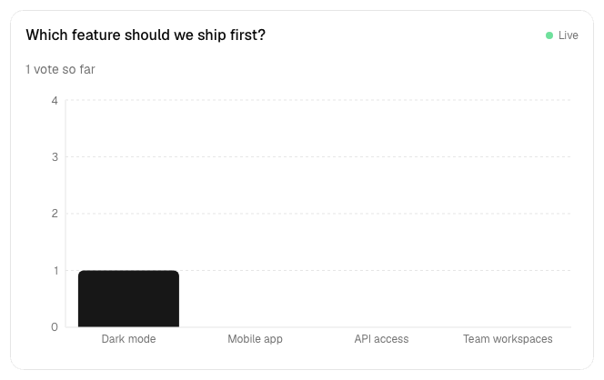
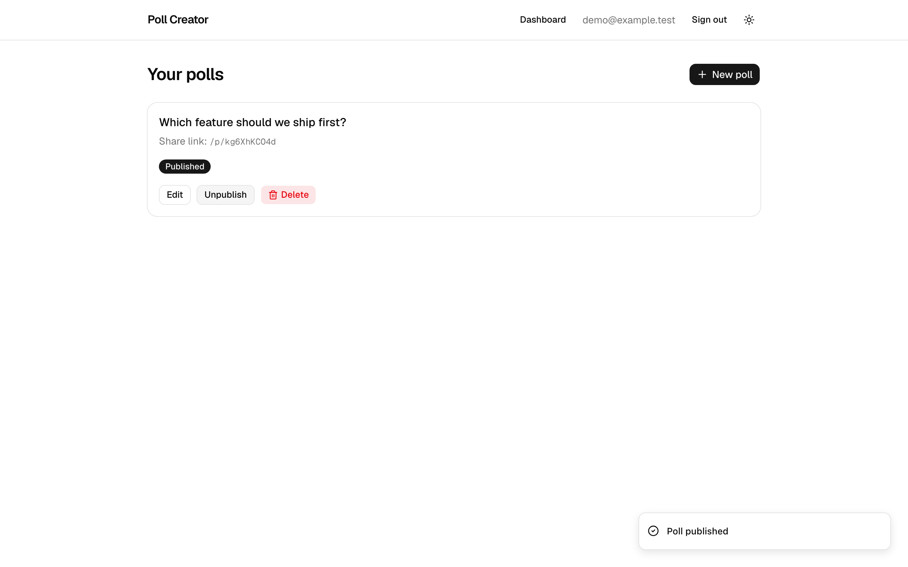
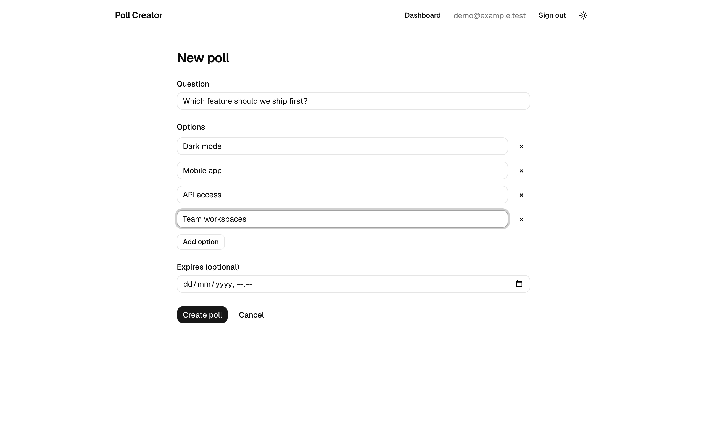
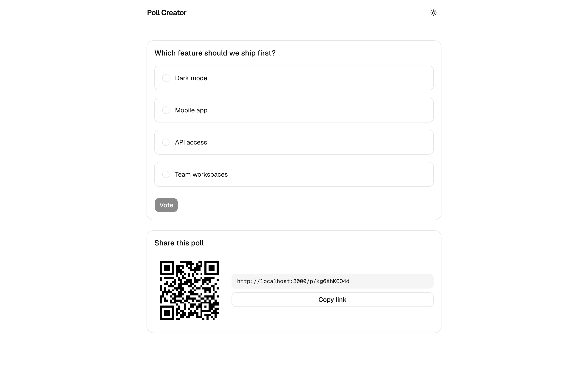
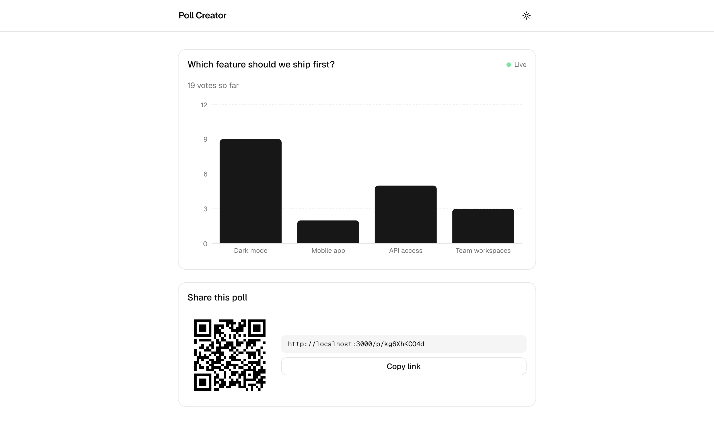
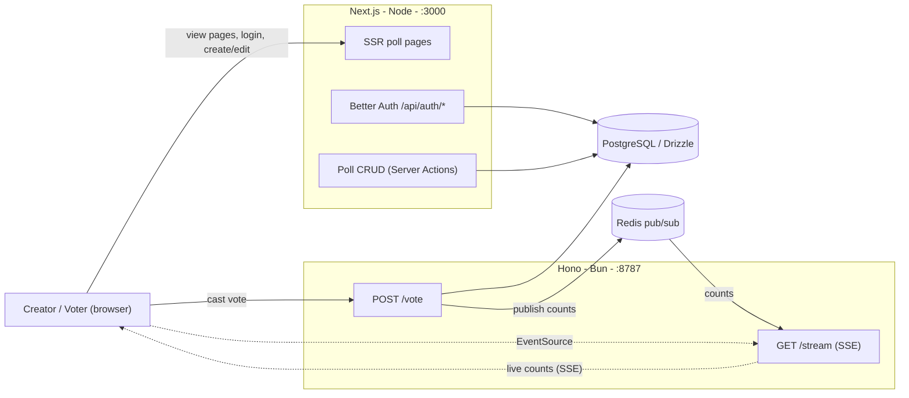

# 🗳️ Poll Creator

> Create a poll, share a link, and watch the results update **live** as votes arrive.

[](https://github.com/febbryandika/poll-creator/actions/workflows/ci.yml)

A real-time polling app built as a **Next.js + Hono monorepo**. Authenticated users create polls;
anyone with the link votes without an account; results stream to every open tab over Server-Sent
Events, fanned out through Redis pub/sub.

<p align="center">
  
  <br />
  <em>Results update live as votes arrive — no refresh.</em>
</p>

## Why two servers?

Most of the app is idiomatic Next.js fullstack — SSR poll pages, Better Auth, and poll CRUD via
Server Actions. But **live SSE fan-out to many simultaneous viewers wants a long-lived process**,
which serverless functions handle poorly. So the public real-time surface (`vote` + `stream`) lives
in a small **Hono server on Bun**, bridged to the web app by Redis pub/sub. That split — and the
live-update moment it enables — is the whole point of the project.

## Features

- 🔐 Email/password + optional Google auth (Better Auth)
- 📝 Create polls: a question + 2–6 options, with an optional expiry
- 🔗 Public voting via a shareable link — no account needed
- 🗳️ One vote per browser session, enforced by a database `UNIQUE` constraint
- 📡 Live results over SSE with an animated bar chart (Recharts)
- ⏱️ Publish / unpublish, edit-before-votes, and poll expiry

<details>
<summary>📸 Screenshots</summary>

<p align="center">
  
  
  
  
</p>

</details>

## Tech stack

| Layer         | Tech                                                                    |
| ------------- | ----------------------------------------------------------------------- |
| Web           | Next.js 16 (App Router) · React 19 · Tailwind v4 · shadcn/ui · Recharts |
| Real-time API | Hono · Bun · SSE (`hono/streaming`) · ioredis                           |
| Database      | PostgreSQL · Drizzle ORM                                                |
| Auth          | Better Auth                                                             |
| Tooling       | pnpm workspace · Vitest · Playwright · GitHub Actions                   |

## Architecture



- **Next.js (`:3000`)** — SSR pages, Better Auth (`/api/auth/*`), poll CRUD via **Server Actions**,
  reads Postgres directly.
- **Hono (`:8787`)** — public `POST /vote`, `GET /results`, `GET /stream` (SSE). Writes votes and
  publishes counts to Redis.
- **Redis pub/sub** — bridges a vote on any Hono instance to every SSE viewer (one shared
  publisher/subscriber per instance, with in-process fan-out).
- **PostgreSQL (Drizzle)** — shared by both apps through a single schema package.

**Vote flow:** `browser → Hono /vote → Postgres insert (deduped) → Redis PUBLISH → every SSE viewer updates live`.

## Quick start

**Prerequisites:** Node ≥ 20, pnpm 10, **Bun** (the API runs on `bun run`), and Docker or Podman
(for local Postgres + Redis).

```bash
# 1. Install workspace dependencies
pnpm install

# 2. Configure env. Copy the values from .env.example into each package's env file
#    (the header in .env.example says which keys go where):
#      apps/api/.env · apps/web/.env.local · packages/db/.env · repo-root ./.env
#    Generate the auth secret:  openssl rand -base64 32

# 3. Start local Postgres + Redis
docker compose up -d

# 4. Create the database schema
pnpm db:migrate

# 5. Run both apps — web on :3000, api on :8787
pnpm dev
```

Open **http://localhost:3000**, register, create and publish a poll, then open its share link in a
second browser (or an incognito window) and vote — the creator's results page updates live, no
refresh. Google login is optional; leave `GOOGLE_*` blank to use email/password only.

> If port 5432 is taken, set `POSTGRES_PORT` in a repo-root `./.env` and match it in every
> `DATABASE_URL`. The web app and API **must share the same `DATABASE_URL`**.

## Environment variables

| Variable                                    | Used by      | Purpose                                               |
| ------------------------------------------- | ------------ | ----------------------------------------------------- |
| `DATABASE_URL`                              | api, web, db | Postgres connection (shared)                          |
| `REDIS_URL`                                 | api          | Redis pub/sub over TCP (e.g. Upstash `rediss://…`)    |
| `PORT`                                      | api          | Hono port (default `8787`)                            |
| `WEB_ORIGIN`                                | api          | Allowed CORS origin (the web app)                     |
| `NEXT_PUBLIC_API_URL`                       | web          | Browser → Hono API base URL                           |
| `BETTER_AUTH_SECRET` / `BETTER_AUTH_URL`    | web          | Better Auth session signing + base URL                |
| `GOOGLE_CLIENT_ID` / `GOOGLE_CLIENT_SECRET` | web          | Optional Google OAuth                                 |
| `TEST_DATABASE_URL`                         | tests        | Disposable `*_test` DB (see [TESTING.md](TESTING.md)) |

Full details and the per-package split live in [`.env.example`](.env.example).

## API

The public real-time surface is Hono; poll CRUD is Next.js Server Actions; auth is Better Auth.

| Method | Server | Path                   | Auth | Purpose                             |
| ------ | ------ | ---------------------- | ---- | ----------------------------------- |
| POST   | Hono   | `/vote`                | ❌   | Cast a vote (deduped per session)   |
| GET    | Hono   | `/results?shareCode=…` | ❌   | Current vote counts                 |
| GET    | Hono   | `/stream?shareCode=…`  | ❌   | Live counts over SSE                |
| GET    | Hono   | `/health`              | ❌   | Liveness check                      |
| —      | Next   | Server Actions         | ✅   | Create / update / delete / publish  |
| \*     | Next   | `/api/auth/*`          | —    | Better Auth (sign-in/up/out, OAuth) |

Full reference — request/response shapes, the SSE event protocol, and the error format — is in
[`docs/API.md`](docs/API.md).

## Project structure

```text
poll-creator/
├── apps/
│   ├── web/              # Next.js 16 — SSR pages, auth, poll CRUD (Server Actions)
│   │   ├── app/          #   App Router: (app) authed · (auth) login/register · (public) vote/results
│   │   ├── components/   #   PollForm, VoteCard, LiveResults, ShareBox, ui/ (shadcn)
│   │   └── lib/          #   auth, db client, validations, use-live-results (SSE hook)
│   └── api/              # Hono on Bun — public real-time surface
│       └── src/
│           ├── routes/   #   public.ts — POST /vote, GET /results, GET /stream (SSE)
│           └── lib/      #   redis (pub/sub), db, errors, logger, validation
├── packages/
│   └── db/               # Shared Drizzle schema + client + queries + migrations
├── test/                 # Vitest global setup (migrate + truncate the test DB)
├── e2e/                  # Playwright happy-path spec
├── docs/                 # API.md, DATABASE.md, screenshots/
├── docker-compose.yml    # local Postgres + Redis
├── vitest.config.ts · playwright.config.ts
└── pnpm-workspace.yaml
```

## Testing

Integration-first, with **no mocking** — real Postgres, real Redis, the real Hono app, and a real browser.

```bash
pnpm test        # Vitest: DB logic (dedup, counts, lifecycle), the API + SSE, Zod schemas
pnpm test:e2e    # Playwright: create → share → vote → live-update happy path
```

See [`TESTING.md`](TESTING.md) for prerequisites and how the disposable test database works.

## Database

Three app tables — `polls`, `options`, `votes` — plus the Better Auth tables. The schema, an ER
diagram, and the constraints (including the `UNIQUE(poll_id, session_key)` dedup guard and cascade
deletes) are documented in [`docs/DATABASE.md`](docs/DATABASE.md).

## Future improvements

- **Warm the Redis publisher on boot** so the very first live update after a cold start isn't
  dropped (the best-effort publish currently misses its first cold-connection call).
- **Rate-limit `POST /vote`** per IP, on top of the per-session DB dedup.
- **Load-test the multi-instance SSE fan-out** (several Hono instances behind one Redis).
- **Optional multi-select polls** (single-choice by design today).
- **Run the Playwright E2E in CI** as a separate job (Bun + Postgres/Redis services).
- **Align Node versions** across `engines`, CI, and `@types/node`.
