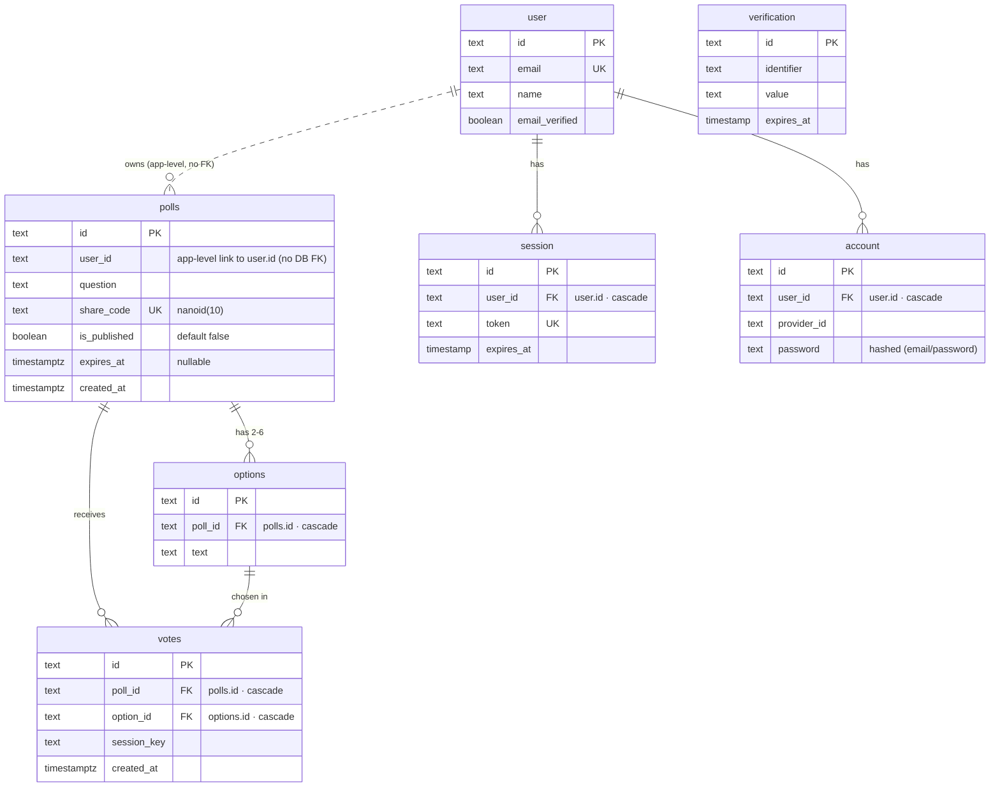

# Database Schema

PostgreSQL via Drizzle ORM. The schema lives in `packages/db/schema.ts` (app tables) and
`packages/db/auth-schema.ts` (Better Auth tables); migrations are in `packages/db/drizzle/`.

## App tables

### `polls`

The poll itself. `id` and `share_code` are generated with `nanoid` (`share_code` is a short public
handle used in `/p/{shareCode}` links). `user_id` links to the creator but is **an application-level
reference only — there is no database foreign key** to `user` (drawn dashed above). Indexed on
`user_id` (`idx_poll_user`).

### `options`

A poll's answer choices (2–6, enforced in the Zod layer). `poll_id` → `polls.id` **ON DELETE
CASCADE**, so deleting a poll removes its options.

### `votes`

One row per cast vote. `poll_id` → `polls.id` and `option_id` → `options.id`, both **ON DELETE
CASCADE**. Indexed on `poll_id` (`idx_vote_poll`).

**The dedup guard:** `UNIQUE(poll_id, session_key)` (`uq_vote`). Votes are inserted with
`onConflictDoNothing`, so a second vote from the same browser session on the same poll is silently
ignored — this is what enforces "one vote per session" for single-choice polls.

## Auth tables (Better Auth)

`user`, `session`, `account`, and `verification` are managed by Better Auth via its Drizzle adapter.
`session.user_id` and `account.user_id` are real foreign keys to `user.id` (**ON DELETE CASCADE**).
`user.email` and `session.token` are unique. `account.password` holds the hashed email/password
credential; `account.provider_id` distinguishes email/password from Google OAuth.

## Notes

- **Timestamps:** app tables use `timestamp with time zone`; the Better Auth tables use plain
  `timestamp` (no time zone) — a deliberate consequence of keeping the auth schema as Better Auth
  generates it.
- **Migrations:** `pnpm db:migrate` applies `drizzle/0000_*.sql` (app tables) and
  `drizzle/0001_*.sql` (auth tables). Regenerate after schema edits with `pnpm db:generate`.
